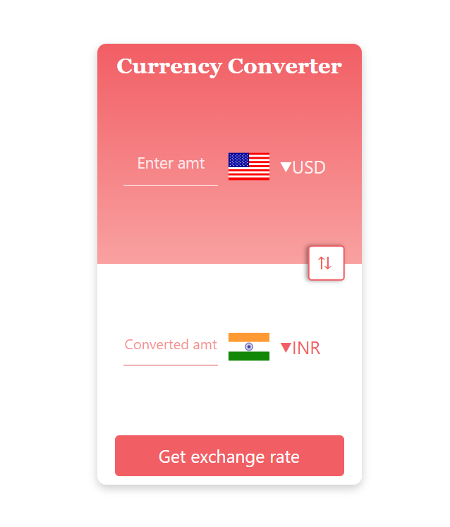

# 💱 Currency Converter

A clean and modern Currency Converter web application built with **HTML**, **CSS**, and **JavaScript**. It allows users to convert an amount from one currency to another in real time using the [CurrencyAPI](https://currencyapi.com/).

## 🌐 Live Demo
[Click here to try it out](#)  


---

## 📸 Screenshot

  


---

## 🚀 Features

- 🔄 Real-time currency conversion using live exchange rates
- 🌍 Dropdowns with country flags and currency codes
- 🔁 Swap currencies button
- 🎨 Smooth user interaction with focus styling

---

## 🛠️ Technologies Used

- HTML5
- CSS3
- JavaScript (Vanilla)
- [CurrencyAPI](https://currencyapi.com/)
- [FlagsAPI](https://flagsapi.com/)

---
## 📂 Project Structure

```bash
.
├── index.html            # Main HTML file
├── style.css             # Styling for the app
├── app.js                # Main JavaScript logic
├── codes.js              # Currency and country mapping object
└── README.md             # This README file


## 🔑 Setup & How to Use

 **Clone the repository**
   ```bash
   git clone https://github.com/yourusername/currency-converter.git
   cd currency-converter


## 🔗 API Reference
CurrencyAPI – Used for fetching live exchange rates
https://currencyapi.com/

FlagsAPI – Used for displaying country flags
https://flagsapi.com/

## 📌 Note
You need an API key from CurrencyAPI to make it work.

Make sure the key used in app.js is valid and has access to the latest endpoint.

---